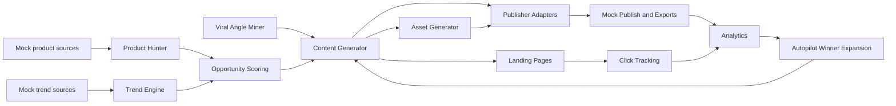

# Claw Commerce Operator

An OpenClaw-powered affiliate commerce operator for Pinterest, TikTok, and owned landing pages. It finds mock trending products, mines reusable viral angles, scores opportunities, generates original content, creates visual assets, builds landing pages, mock-publishes or exports posts, tracks clicks, imports metrics, and expands winners through autopilot.

Demo mode works without paid credentials.

## Quick Start

```bash
npm install
npm run seed
npm run dev
```

Open the local dashboard at the URL printed by Next.

## Main Scripts

```bash
npm run dev
npm run seed
npm run worker
npm run autopilot:dry
npm run autopilot:full
npm run scan:products
npm run scan:trends
npm run generate:content
npm run generate:assets
npm run publish:mock
npm run analytics:mock
npm run test
npm run lint
```

## Dashboard

- Overview
- Products
- Trends
- Viral Angles
- Content Generator
- Asset Preview
- Scheduler
- Landing Pages
- Analytics
- Autopilot
- Settings
- Logs

## Public Routes

- `/p/[slug]`
- `/guides/[slug]`
- `/compare/[slug]`
- `/go/[linkId]`

`/go/[linkId]` records click events and redirects to the product affiliate URL.

## Architecture



## Data Modes

- Demo JSON state: `storage/demo-state.json`
- Prisma/Postgres schema: `prisma/schema.prisma`
- Redis/BullMQ worker: enabled when `REDIS_URL` is set
- Local storage adapter: `src/lib/storage/adapter.ts`

## OpenClaw

Workspace files:

- `AGENTS.md`
- `OPENCLAW_SETUP.md`
- `skills/claw-commerce/SKILL.md`
- `openclaw/operator.md`
- `openclaw/schedules.md`

Run OpenClaw from the repository root so the workspace skill and standing orders are visible.

## Compliance Defaults

- Owned accounts only
- No fake engagement automation
- No reposting exact creator content
- Affiliate disclosure included in posts and landing pages
- Mock/export fallback when credentials are missing

## Verification

```bash
npm run lint
npm run test
npm run build
```
