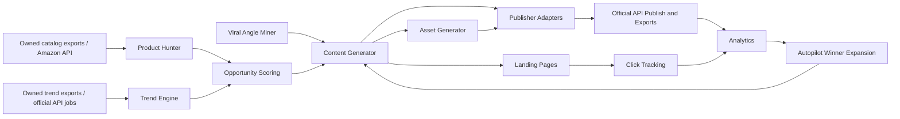

# Claw Commerce Operator

An OpenClaw-powered affiliate commerce operator for Pinterest, TikTok, and owned landing pages. It imports real product and trend data from configured owned exports or official APIs, scores opportunities, generates original content, creates visual assets, builds landing pages, publishes through official platform APIs when credentials are present, tracks clicks, imports real metrics, and expands winners through autopilot.

Set `OPERATOR_MODE=real` and configure the inputs in `.env.example` for live operation. Demo/test fallback remains available only when real mode is not enabled.

## Quick Start

```bash
npm install
npm run seed
npm run dev
```

Open the local dashboard at the URL printed by Next.

## Main Scripts

```bash
npm run dev
npm run seed
npm run worker
npm run autopilot:dry
npm run autopilot:full
npm run scan:products
npm run scan:trends
npm run generate:content
npm run generate:assets
npm run publish:real
npm run analytics:real
npm run test
npm run lint
```

## Dashboard

- Overview
- Products
- Trends
- Viral Angles
- Content Generator
- Asset Preview
- Scheduler
- Landing Pages
- Analytics
- Autopilot
- Settings
- Logs

## Public Routes

- `/p/[slug]`
- `/guides/[slug]`
- `/compare/[slug]`
- `/go/[linkId]`

`/go/[linkId]` records click events and redirects to the product affiliate URL.

## Architecture



## Real Inputs

- `PRODUCT_CATALOG_JSON`: owned product catalog export, local path or URL.
- `TREND_FEED_JSON`: owned trend export from official/API-backed tools.
- `ANALYTICS_IMPORT_JSON`: real metric import export.
- `OPENAI_API_KEY` or `ANTHROPIC_API_KEY`: real copy generation.
- `OPENAI_API_KEY` plus `ASSET_PROVIDER=openai`: real raster asset generation.
- `PINTEREST_ACCESS_TOKEN` and `PINTEREST_BOARD_ID`: real Pin creation.
- `TIKTOK_ACCESS_TOKEN` and `TIKTOK_PHOTO_URLS`: real TikTok Content Posting API initialization.
- `NEXT_PUBLIC_APP_URL`: public HTTPS owned domain used for landing links and assets.

## Data Storage

- JSON state: `storage/demo-state.json`
- Prisma/Postgres schema: `prisma/schema.prisma`
- Redis/BullMQ worker: enabled when `REDIS_URL` is set
- Local storage adapter: `src/lib/storage/adapter.ts`

## OpenClaw

Workspace files:

- `AGENTS.md`
- `OPENCLAW_SETUP.md`
- `skills/claw-commerce/SKILL.md`
- `openclaw/operator.md`
- `openclaw/schedules.md`

Run OpenClaw from the repository root so the workspace skill and standing orders are visible.

## Compliance Defaults

- Owned accounts only
- No fake engagement automation
- No reposting exact creator content
- Affiliate disclosure included in posts and landing pages
- In `OPERATOR_MODE=real`, missing live credentials are logged and skipped instead of faked.

## Verification

```bash
npm run lint
npm run test
npm run build
```
